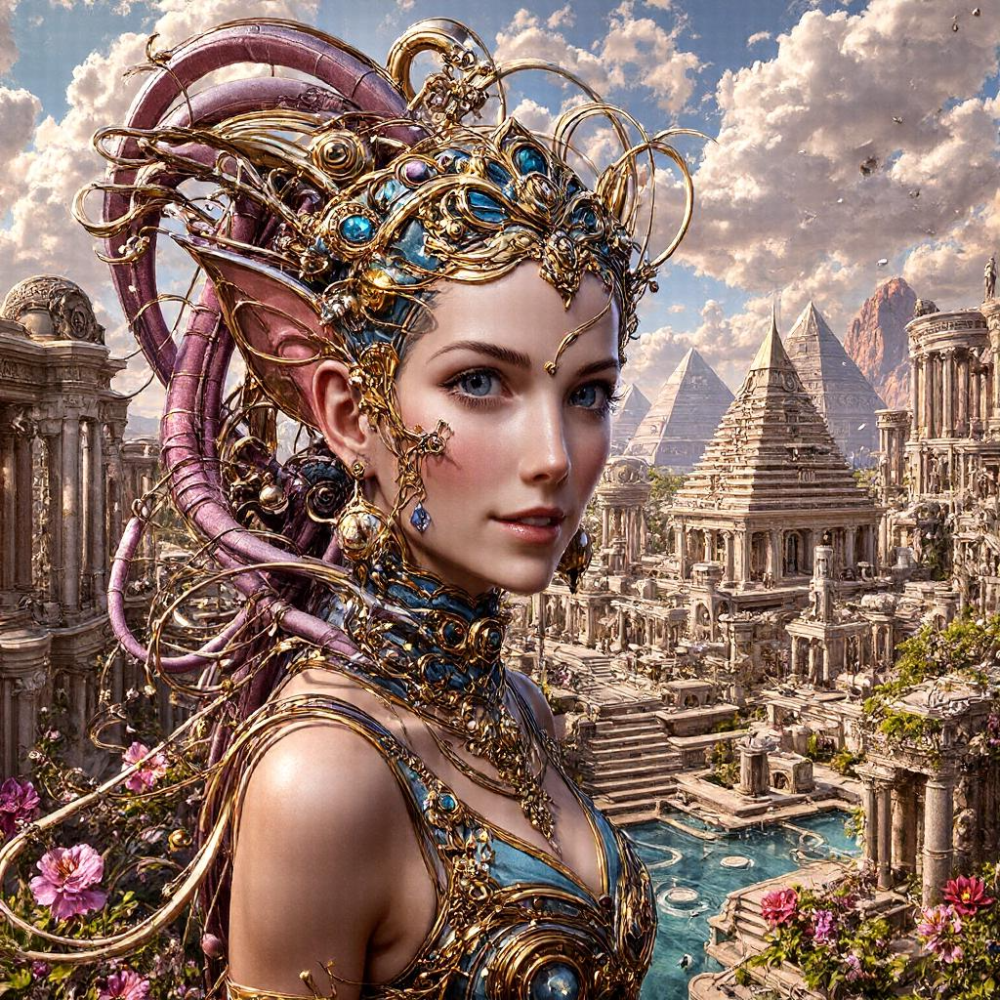
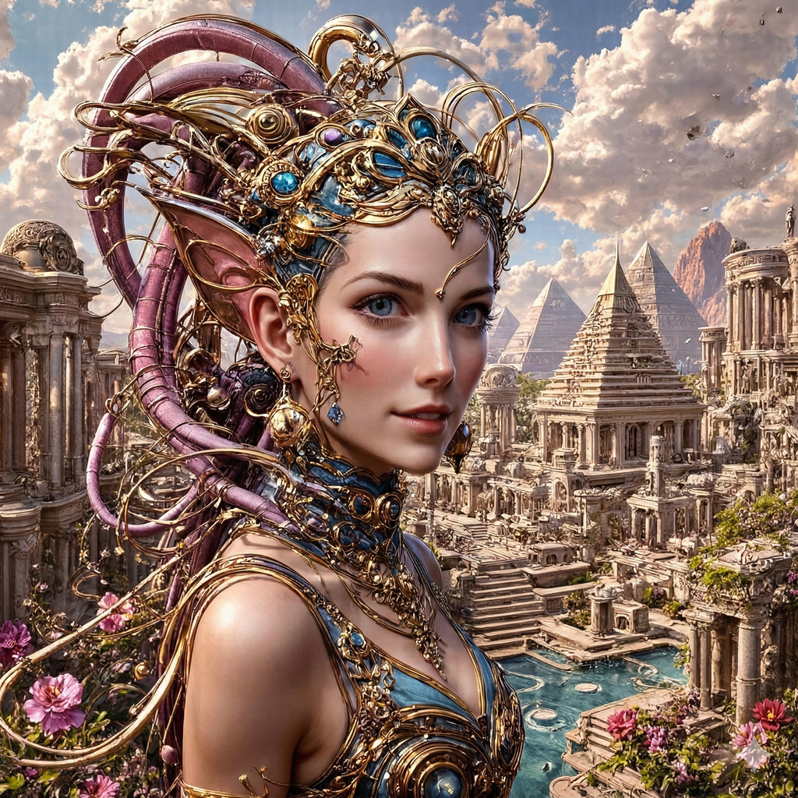

# RealGRPO: A Simple Way to Eliminate Reward Hacking in GRPO Diffusion Alignment


<div align="center">

[](https://huggingface.co/YangZhou24/RealGRPO)&nbsp;

</div>

## 🔍 Quick Visual Comparison

<table>
  <tr>
    <th width="18%">Input Prompt</th>
    <th width="27%">FLUX</th>
    <th width="27%">DanceGRPO (HPSv2)</th>
    <th width="28%">RealGRPO (HPSv2)</th>
  </tr>

  <tr>
    <td><br/>A close-up portrait of a young woman with long hair smiling at the camera.</td>
    <td></td>
    <td></td>
    <td></td>
  </tr>

  <tr>
    <td><br/>The image depicts a young female in ornate battle armor wearing a metallic helmet with long dark hair and symmetrical facial features.</td>
    <td></td>
    <td></td>
    <td></td>
  </tr>

  <tr>
    <td>An eightyearold, smiling, redhaired girl with glasses, dressed in a pink pirate costume, holding a stuffed toy dog. Full body.</td>
    <td></td>
    <td></td>
    <td></td>
  </tr>

  <tr>
    <td>Poor mom and child in war times</td>
    <td></td>
    <td></td>
    <td></td>
  </tr>

  <tr>
    <td>Celtic goddess with red hair and green warrior outfit, fantasy character concept, pure, benevolent, strong, portrait, line art, realistic, hypermaximalist, intricate details, epic composition, golden</td>
    <td></td>
    <td></td>
    <td></td>
  </tr>

  <tr>
    <td>A gopro snapshot of an anthropomorphic cat dressed as a firefighter putting out a building fire</td>
    <td></td>
    <td></td>
    <td></td>
  </tr>

</table>
<p align="center">
  <em>Compared with FLUX, RealGRPO generates images with fewer synthetic artifacts. Compared with DanceGRPO, it mitigates HPSv2-driven reward hacking, especially the tendency toward over-saturated outputs.</em>
</p>
<table>
  <tr>
    <th width="18%">Input Prompt</th>
    <th width="27%">FLUX</th>
    <th width="27%">SRPO (HPSv2)</th>
    <th width="28%">RealGRPO (HPSv2)</th>
  </tr>

  <tr>
    <td>A digital <b>painting</b> of an Aztec empress in sharp focus, portrayed as a fantasy portrait in concept art style.</td>
    <td></td>
    <td></td>
    <td></td>
  </tr>

  <tr>
    <td>Portrait of a woman touching her hair, artstation, <b>digital art</b>.</td>
    <td></td>
    <td></td>
    <td></td>
  </tr>

  <tr>
    <td><b>Hayao Miyazaki style</b>, ghibli style, Perspective composition, а Volkswagen T5, seaside, Italian riviera, blue sky, a few white clouds, breeze, mountains, cozy, travel, sunny, best quality, 4k niji</td>
    <td></td>
    <td></td>
    <td></td>
  </tr>

  <tr>
    <td>Real life <b>sasuke uchiha anime</b> with sad and crying face set in 1980s Japan in cyberpunk world, detailed faces, lens flares, city backgrounds, neon colors, dramatic lighting, incredible details, saturat.</td>
    <td></td>
    <td></td>
    <td></td>
  </tr>

  <tr>
    <td><b>Grunge painting</b> of an empty road with a distant forest.</td>
    <td></td>
    <td></td>
    <td></td>
  </tr>

</table>

<p align="center">
  <em>Unlike SRPO's fixed prompt templates, RealGRPO uses a LLM to adaptively extract positive and negative style cues for each input prompt. This preserves prompt intent across domains (e.g., artistic or anime styles) instead of collapsing toward a single photorealistic bias.</em>
</p>

## 🌟 Method

When training diffusion models with GRPO, directly maximizing a reward model (e.g., HPSv2) can cause **reward hacking**. The model may exploit shortcut artifacts (such as over-smoothing, over-exposure, and unnatural contrast) to increase reward scores without improving real visual quality.

Inspired by [SRPO](https://github.com/Tencent-Hunyuan/SRPO), we use contrastive positive/negative text guidance. Instead of using fixed, hand-crafted style prompts, **RealGRPO** introduces a LLM that analyzes each training prompt and dynamically generates matched `pos_style` and `neg_style` pairs.

This dynamic strategy preserves style consistency across prompt domains (e.g., photorealistic vs. anime) while discouraging reward-hacking artifacts. We integrate it into the **[DanceGRPO](https://github.com/XueZeyue/DanceGRPO)** with the following reward:

$$Reward=(1 + \lambda)\cdot\text{Sim}(Image, Text_{pos}) -  \text{Sim}(Image, Text_{neg})$$

This objective pulls generations toward desired styles and away from artifact-prone directions.

## Checkpoint Setup

1. Download FLUX.1-dev from [Hugging Face](https://huggingface.co/black-forest-labs/FLUX.1-dev) to `./checkpoints/flux`.
2. Download HPS-v2.1 (`HPS_v2.1_compressed.pt`) from [Hugging Face](https://huggingface.co/xswu/HPSv2/tree/main) to `./checkpoints/hps_ckpt`.
3. Download CLIP ViT-H-14 (`open_clip_pytorch_model.bin`) from [Hugging Face](https://huggingface.co/laion/CLIP-ViT-H-14-laion2B-s32B-b79K/tree/main) to `./checkpoints/hps_ckpt`.
4. Download Qwen3-4B from [Hugging Face](https://huggingface.co/Qwen/Qwen3-4B) to `./checkpoints/Qwen3-4B`.

## 🛠️ Installation

```bash
git clone https://github.com/yangzhou24/RealGRPO.git
cd RealGRPO
conda create --name RealGRPO python=3.10
conda activate RealGRPO
bash env_setup.sh
```

Prepare the reward model:
```bash
mkdir third_party && cd third_party
git clone https://github.com/tgxs002/HPSv2.git
cd HPSv2 && pip install -e .
```

## 📖 Quick Start
### 1. Data Preparation (Get text embeddings & LLM Labeling)
For the open-source image generation setting, we use prompts from [HPDv2](https://huggingface.co/datasets/ymhao/HPDv2/tree/main), provided in `./assets/prompts.txt`.

First, generate text embeddings (required):
```bash
# FLUX preprocessing with multiple GPUs
bash scripts/preprocess/preprocess_flux_rl_embeddings.sh
```

Then use Qwen3-4B to extract adaptive `pos_style` and `neg_style` prompts from training text.  
The output is stored in `data/rl_embeddings/videos2caption_cfg.json`.

Each entry follows:
`<prompt>|||<pos_style_1, pos_style_2, pos_style_3>|||<neg_style_1, neg_style_2, neg_style_3>`

Examples:
```text
A full body shot of many Asian girls in a river by Artgerm.|||Natural-lighting, Detailed, Real|||Anime, Flat, Painting
A cute anthropomorphic portrait of Stan Lee in a fantasy art style by various artists.|||Fantasy, Ethereal, Colorful|||Real, Photorealistic, 2D
```

```bash
torchrun --nproc_per_node=<NUM_GPUS> fastvideo/data_preprocess/preprocess_text_Qwen3.py \
  --input-json data/rl_embeddings/videos2caption.json \
  --output-dir data/rl_embeddings
```

### 2. GRPO Fine-Tuning
Run GRPO fine-tuning to update the DiT backbone.

> Reference setup: 32x A800 GPUs for around 80~100 steps.

```bash
bash scripts/finetune/finetune_flux_realgrpo.sh
```

### 3. Inference
```bash
bash scripts/visualization/vis_flux.sh
```

## Discussion
Reward hacking remains a serious issue in image-generation reward models. A common failure mode is preference for overexposed or grid-like artifacts that inflate reward scores without improving visual quality.

The example below comes from a DanceGRPO model trained with HPSv2. We then remove the grid-like artifact using Nano Banana and rescore both images with HPSv2. The artifact-removed image receives a lower score (`0.385498` vs. `0.394043`), indicating that HPSv2 can reward undesirable grid patterns. This highlights how critical reward-model design is for post-training in generative modeling.

<table>
  <tr>
    <th width="25%">0.394043</th>
    <th width="25%">0.385498</th>
  </tr>

  <tr>
    <td></td>
    <td></td>
  </tr>

</table>


## Acknowledgements
This codebase builds on the open-source implementations of [DanceGRPO](https://github.com/XueZeyue/DanceGRPO) and [SRPO](https://github.com/Tencent-Hunyuan/SRPO).


## Citation
If you find this codebase useful for your research, please kindly cite:
```
@misc{realgrpo,
 author = {Yang Zhou, Haoyu Guo},
 title = {RealGRPO: A Simple Way to Eliminate Reward Hacking in GRPO Diffusion Alignment},
 year = {2026},
 publisher = {GitHub},
 journal = {GitHub repository},
 howpublished = {\url{https://github.com/yangzhou24/RealGRPO}},
}
```